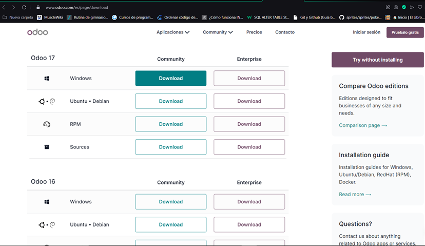
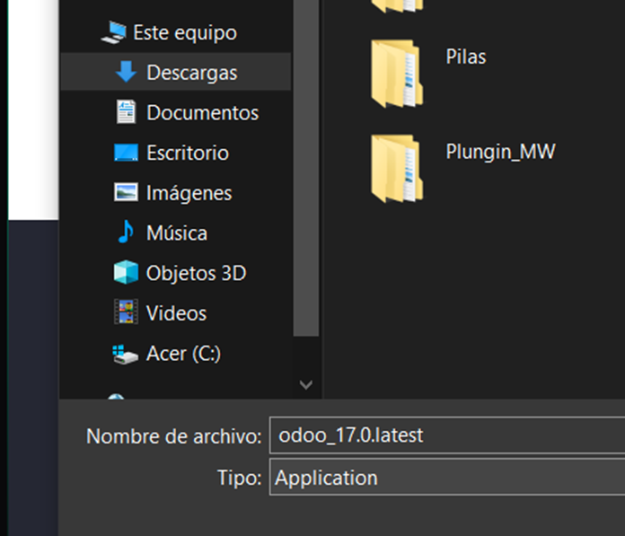
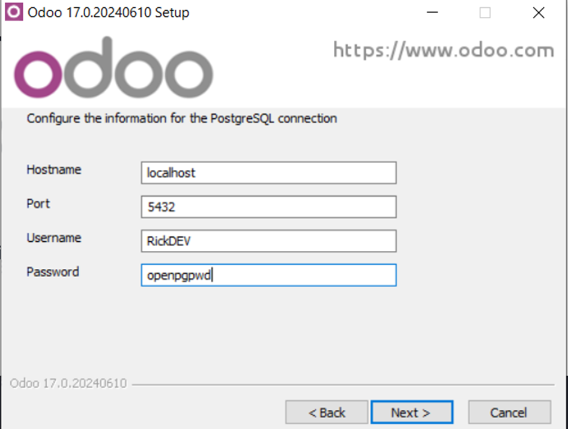
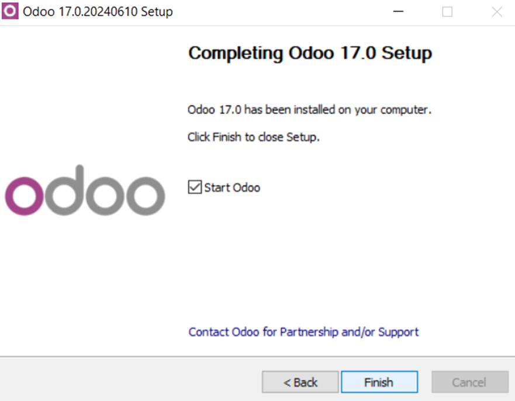
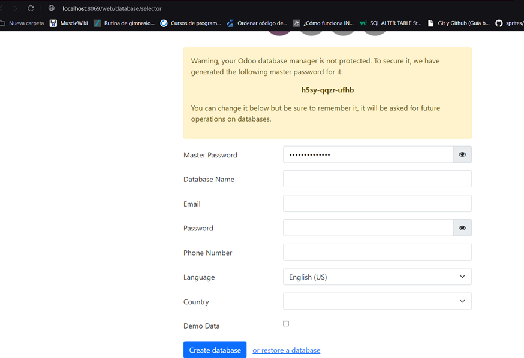
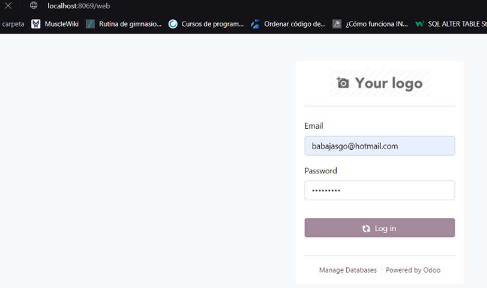
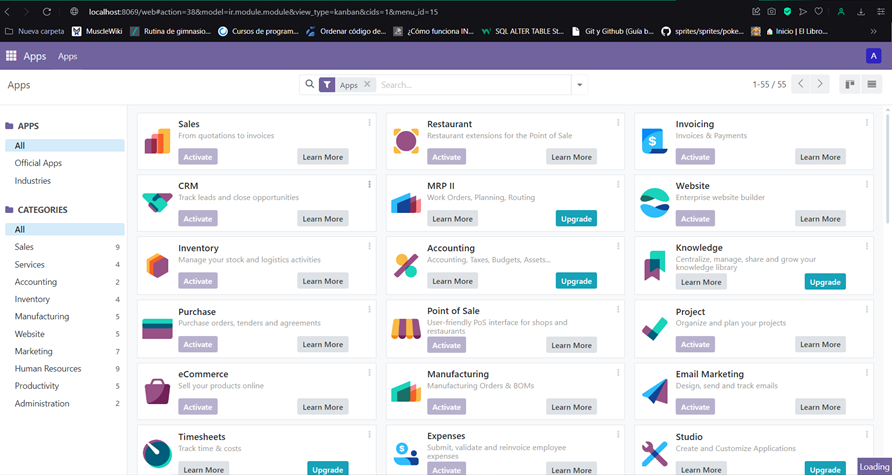
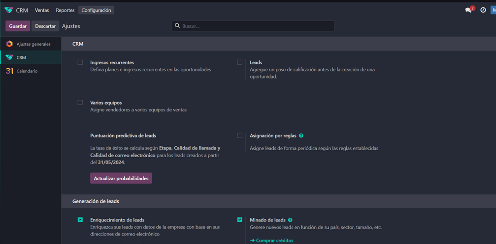
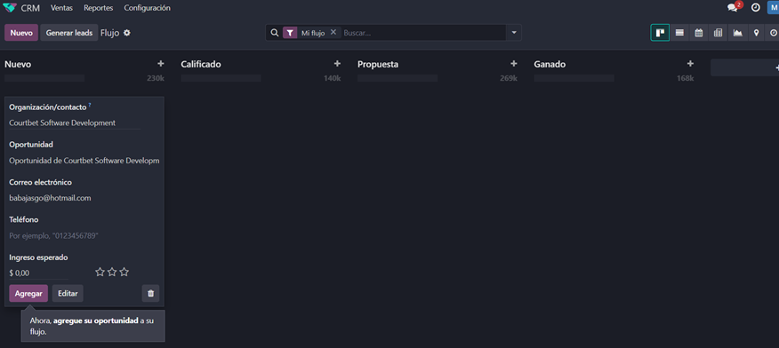
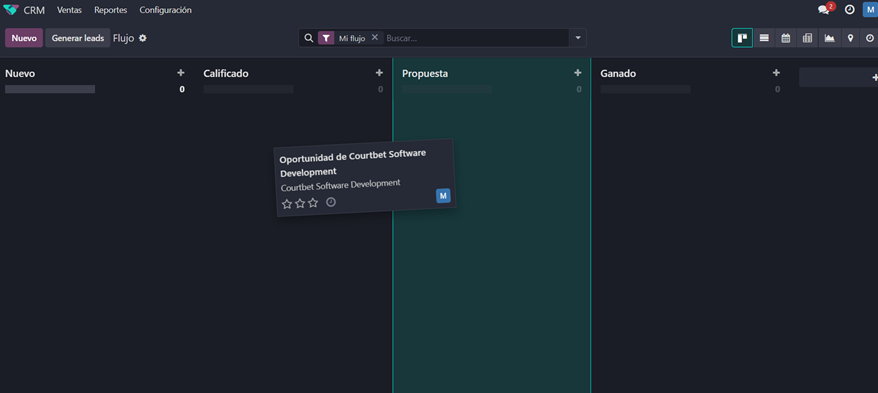

# Instalación y configuración inicial de Odoo.

Antes de instalar Odoo, necesitamos registrarnos en la siguiente página: https://www.odoo.com/es/web/signup, esto para poder generar nuestras database en las cuales poder trabajar sobre nuestro CRM.

## Instalación

Para instalar *Odoo* se tiene que ingresar a la página siguiente: *https://www.odoo.com/es/page/download*, en la cual se nos mostrarán las siguientes versiones tanto para diferentes sistemas operativos como de la misma aplicación, ya que esta cuenta con su versión Community (gratuita) y Enterprise (con licencia y de paga).

 Se nos descargará un archivo de ejecución *.exe* el cual podemos elegir la ruta en donde se descargue, seguimos y una vez hecho eso finalizamos la instalación, para seguir con la configuración inicial de nuestra base de datos y del sistema de CRM.

 Configuramos la información para la conexón a nuestra base de datos, *la base de datos que se utiliza es Postgresql*

 Finalizamos la descarga e iniciamos Odoo

## Configuración inicial

 Una vez instalado se nos abrirá nuestro navegador, ahí de manera local se ejecutará Odoo, primero necesitamos configurar nuestra database con la información que nos solicitan. Se nos advierte que se generó una contraseña master con la que podremos acceder en situaciones de riesgo de perdida de credenciales, podemos personalizarlo o dejarlo así, para terminar la creación de nuestra database:

 Creada nuestra database, podemos ingresar con nuestras credenciales de sesión de Odoo.

 Una vez dentro podemos encontrarnos con todas las aplicaciones que le podemos dar a nuestro sistema, seleccionamos CRM para comenzar.

 Al iniciar se nos abre una interfaz en la cual podemos interactuar con nuestro CRM, en la parte superior derecha encontraremos la sección de configuraciones

 Y para configurar cada caso específico se puede acceder desde la misma acción que hemos registrado en nuestra interfaz, incluso pudiendo organizar reuniones, moverlo de estado, etc.

