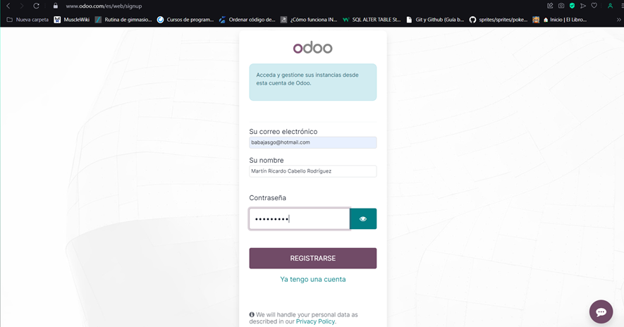
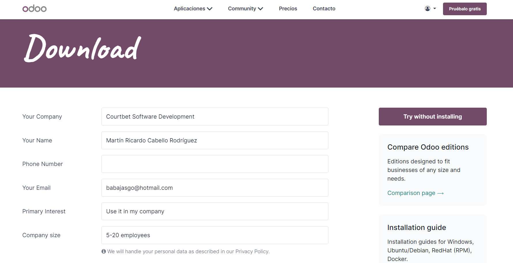

 # Instalación y configuración inicial de Odoo para Linux

## Odoo

Odoo es un software de ERP integrado, cuenta con una versión comunitaria de código abierto bajo licencia comercial LGPLv3 y una versión empresarial bajo licencia comercial, con mas caracterísitcas y complementos a la edición comunitaria. Es una aplicación de software que se construye principalmente con Python y utiliza PostgreSQL como su sistema de gestión de bases de datos.

Además, Odoo también utiliza tecnologías web como HTML, CSS y JavaScript para su interfaz de usuario, y proporciona una API basada en XML-RPC para la integración con otras aplicaciones.

 Para la instalación de Odoo en Linux, en su actual versión 17 necesitaremos de un sistema operativo 

 y de una cuenta ya registrada en https://www.odoo.com/es/web/signup

 Una vez hecho eso tendremos que ingresar a la sección de Community de Odoo para buscar nuestro archivo de instalación, ingresando nuestros datos

## Instalación

Para instalar *Odoo* se tiene que ingresar a la página siguiente: *https://www.odoo.com/es/page/download*, en la cual se nos mostrarán las diferentes versiones para diferentes sistemas operativos, la aplicación cuenta con su versión Community (gratuita) y Enterprise (con licencia y de paga). La versión mas reciente a fecha de la creación de esta documentación es la 17  