# Instalación y configuración inicial de Odoo para Windows 

## Odoo

Odoo es un software de ERP integrado, cuenta con una versión comunitaria de código abierto bajo licencia comercial LGPLv3 y una versión empresarial bajo licencia comercial, con mas caracterísitcas y complementos a la edición comunitaria. Es una aplicación de software que se construye principalmente con Python y utiliza PostgreSQL como su sistema de gestión de bases de datos.

Además, Odoo también utiliza tecnologías web como HTML, CSS y JavaScript para su interfaz de usuario, y proporciona una API basada en XML-RPC para la integración con otras aplicaciones.

 Para la instalación de Odoo en Windows, en su actual versión 17 necesitaremos de un sistema operativo Windows 8 o superior y de una cuenta ya registrada en https://www.odoo.com/es/web/signup

 Una vez hecho eso tendremos que ingresar a la sección de Community de Odoo para buscar nuestro archivo de instalación, ingresando nuestros datos

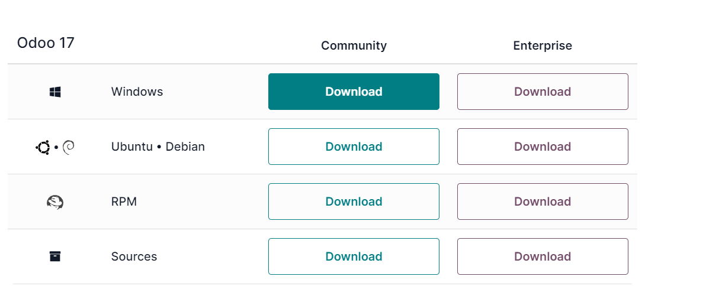

## Instalación

Para instalar *Odoo* se tiene que ingresar a la página siguiente: *https://www.odoo.com/es/page/download*, en la cual se nos mostrarán las diferentes versiones para diferentes sistemas operativos, la aplicación cuenta con su versión Community (gratuita) y Enterprise (con licencia y de paga). La versión mas reciente a fecha de la creación de esta documentación es la 17 pero al usar la paquetería dedicada a nuestro sistema operativo Windows, se nos descargará la versión mas reciente por defecto.

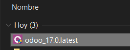

 Iniciamos la instalación aceptando lo que nos solicita el sistema.

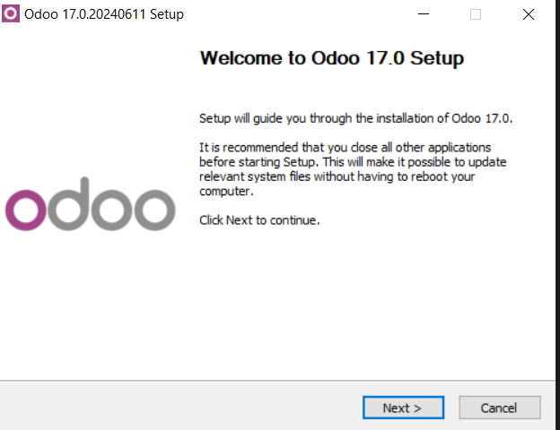

 Nos pedirá seleccionar entre las opciones para poder continuar con la instalación, tomaremos la partición que incluye PostgreSQL y seguimos con la instalación.

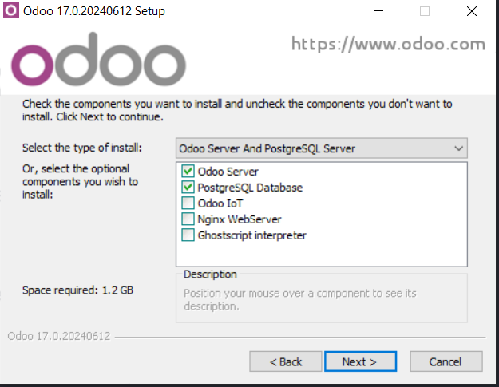

 Además de eso, podremos ingresar los datos de nuestra configuración para PostgreSQL, estos pueden ser por default debido a que solo nos servirán para la conexión.

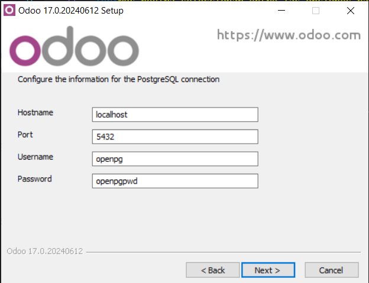

 Seleccionamos la ruta en la que queremos designar la descarga de todos los componentes de Odoo y continuamos con la instalación.

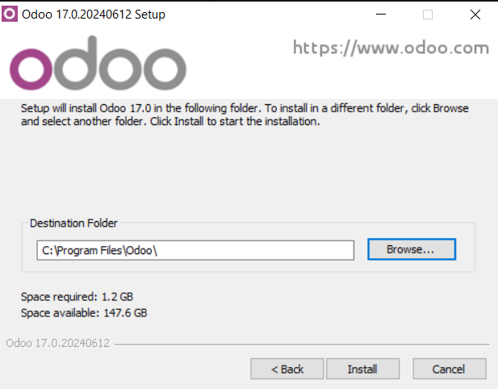

 Además de la instalación de Odoo, se nos instalarán los componentes que ocupa para su correcto funcionamiento, como lo son PostgreSQL en su versión 14, Python 3.12 y las herramientas de compilación para los componentes de Python.

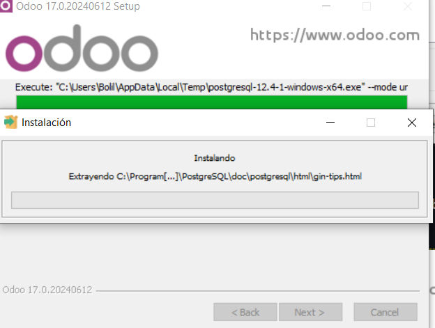

 Finalizamos e iniciamos Odoo.

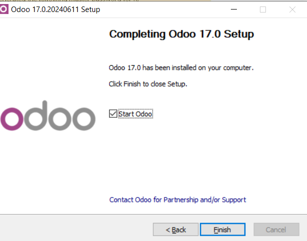

 Una vez hecho esto, nos llevará a nuestro localhost anteriormente definido en los parametros de PostgreSQL, el cual hará la conexión con nuestro servicio de base de datos para conectarnos con el puerto por decault ubicado en el archivo de configuración de Odoo. 
Aquí se nos mostrará un formulario para poder crear nuestra base de datos, la información que ingresemos es importante, comenzando por la Master Password, ya que está es la que usaremos para cualquier tipo de operación de emergencia para nuestras bases de datos, por lo que es recomendable escoger una y resguardarla, además de eso, la información que se requiere mandar es personalizable.

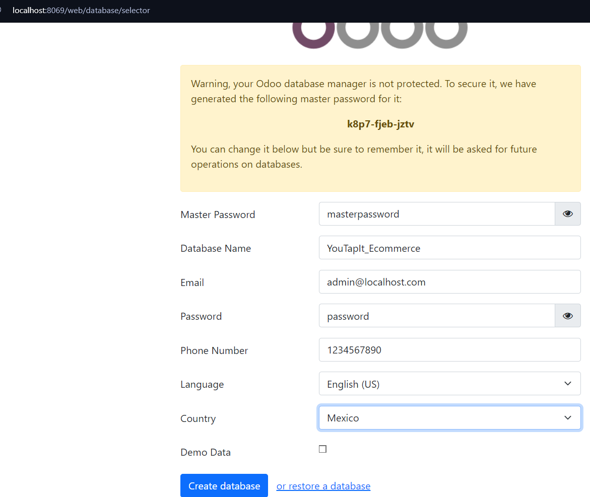

 Nos mandará a la vista de login en la que tendremos que ingresar la información anteriormente proporcionada, como email y password.

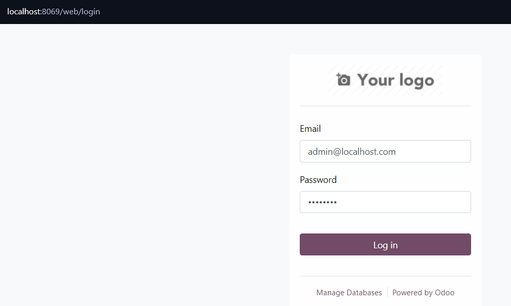

# Configuración inicial

 Podemos acceder a nuestro dashboard, en el cual podremos personalizar valores como el de nuestro usuario.

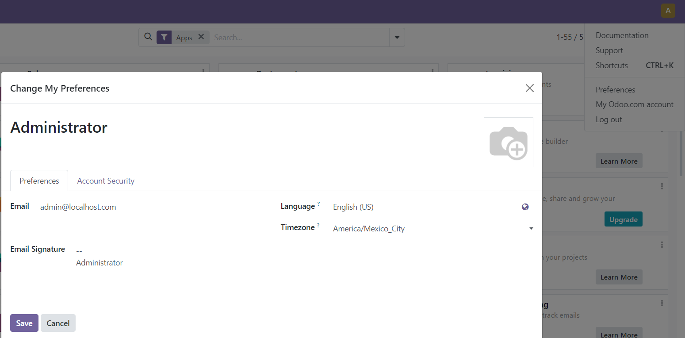

 Es aquí mismo donde podemos activar la APP de nuestro CRM, para ello solo hay que dar clic en el botón.

 Podremos acceder a nuestro CRM a través del botón Discuss. 

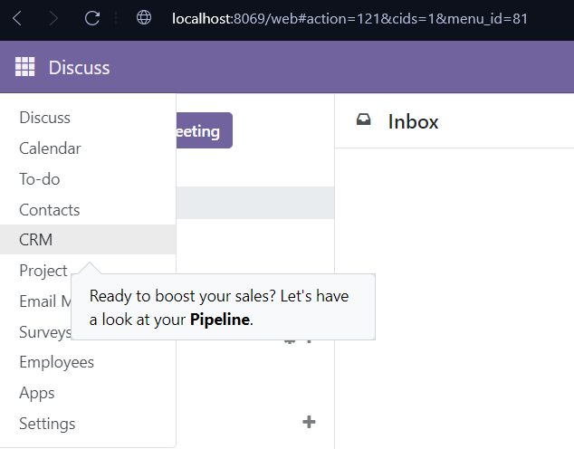

 Finalmente, aquí es donde podemos crear nuestros pipelines.

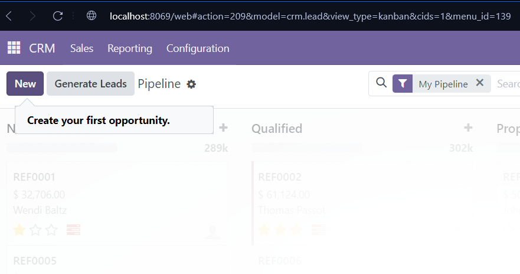

 Podemos darle la información necesaria que ocupemos y su grado de prioridad.

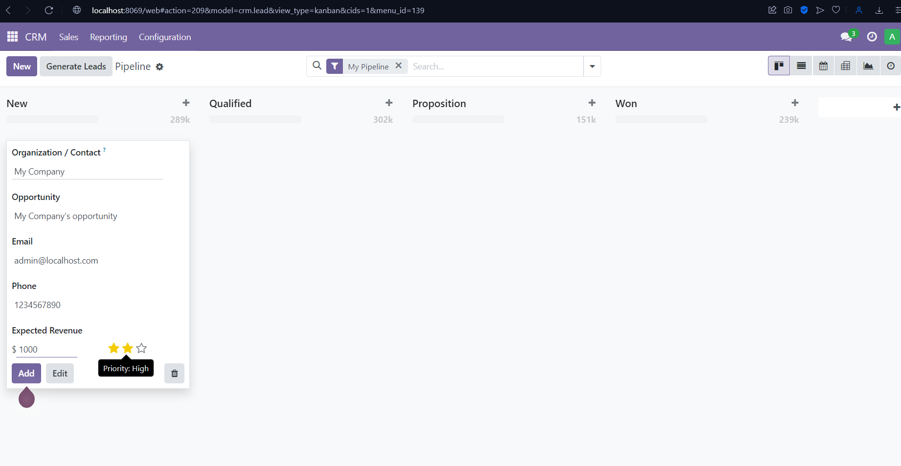

 Por último, podemos dar clic sobre nuestro nuevo elemento para editarlo o eliminarlo, además de poder enviarlo a las diferentes fases de éxito según se encuentre.

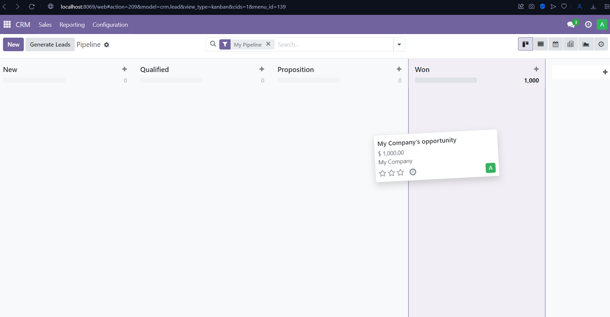