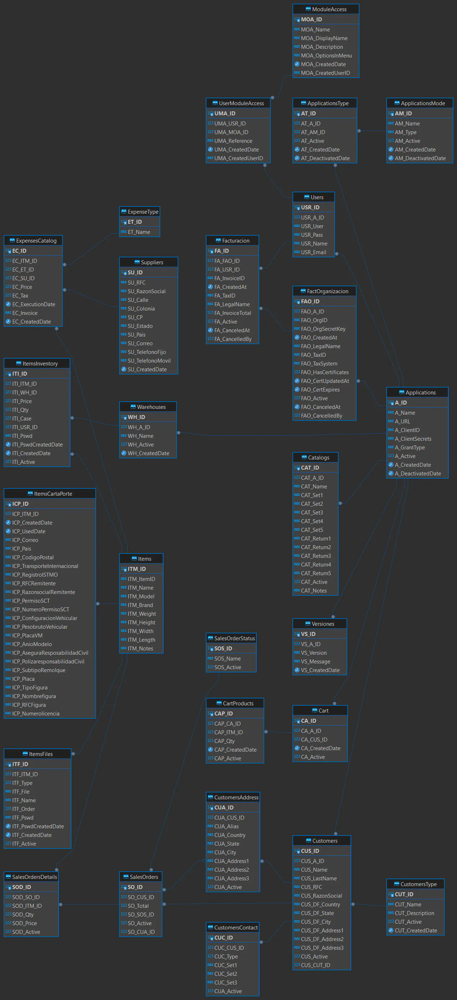

The database was on SQL server 2019 Express.

## Tables

```SQL
/* General */
SELECT * FROM YEC.ApplicationsMode
SELECT * FROM YEC.Applications
SELECT * FROM YEC.ApplicationsType
SELECT * FROM YEC.Versiones

/* Seccion usuarios */
SELECT * FROM YEC.Users
SELECT * FROM YEC.UserModuleAccess
SELECT * FROM YEC.ModuleAccess

/* Customers */
SELECT * FROM YEC.Customers
SELECT * FROM YEC.CustomersAddress
SELECT * FROM YEC.CustomersContact
SELECT * FROM YEC.CustomersType

/* Catalogos */
SELECT * FROM YEC.Catalogs
SELECT * FROM YEC.ExpenseType
SELECT * FROM YEC.Suppliers

/* Inventario */
SELECT * FROM YEC.Warehouses
SELECT * FROM YEC.Items
SELECT * FROM YEC.ItemsInventory
SELECT * FROM YEC.ItemsFiles
SELECT * FROM YEC.ItemsCartaPorte
SELECT * FROM YEC.ExpensesCatalog

/* Carrito */
SELECT * FROM YEC.Cart
SELECT * FROM YEC.CartProducts

/* Ventas */
SELECT * FROM YEC.SalesOrders
SELECT * FROM YEC.SalesOrdersDetails
SELECT * FROM YEC.SalesOrderStatus

/* Facturacion */
SELECT * FROM YEC.Facturacion
SELECT * FROM YEC.FactOrganizacion
```

## SQL Relations Diagram


