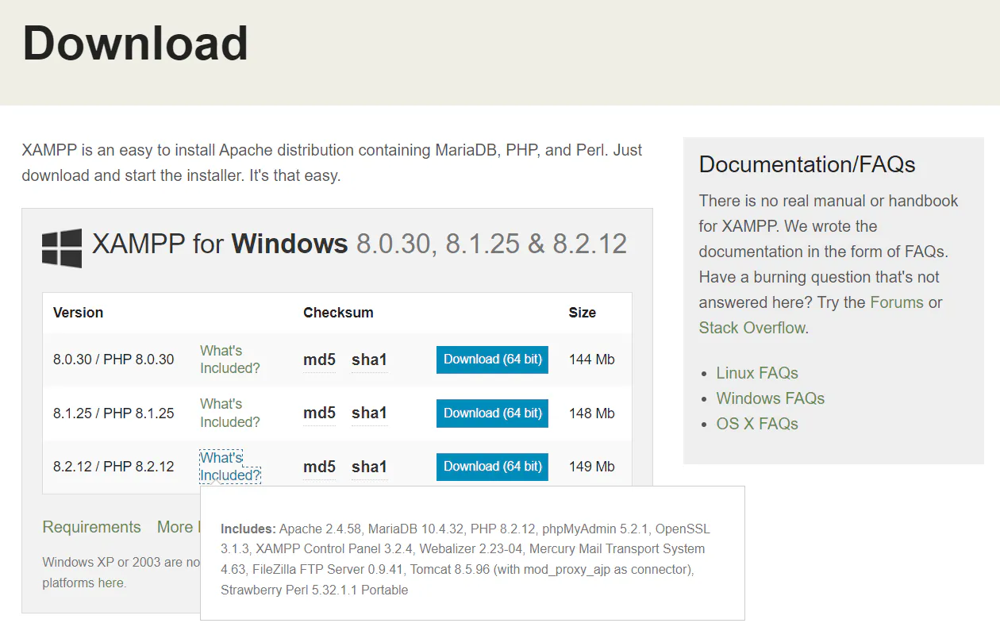
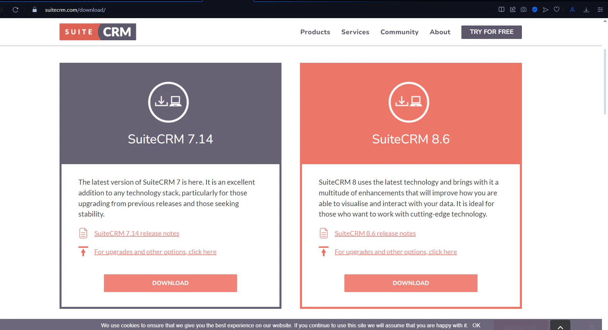
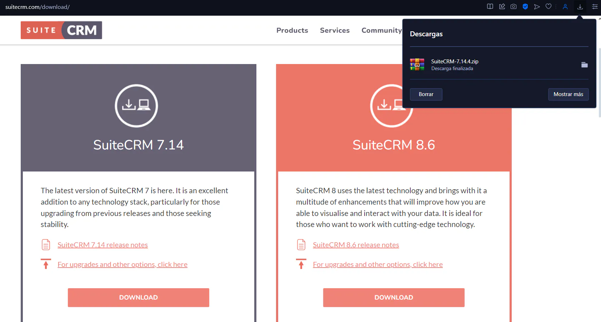
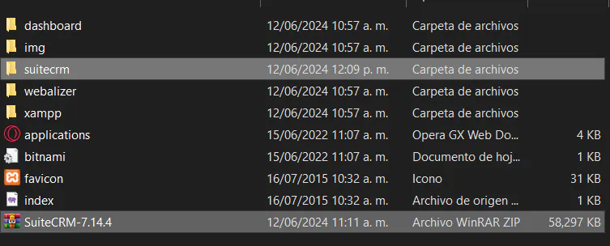
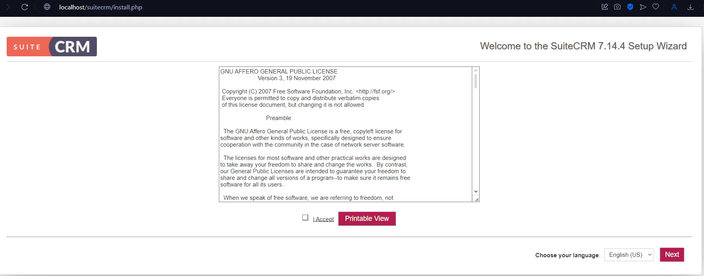
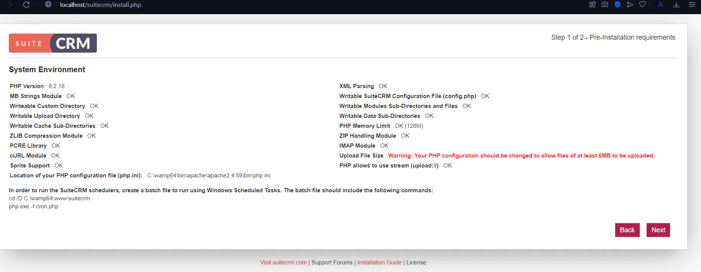
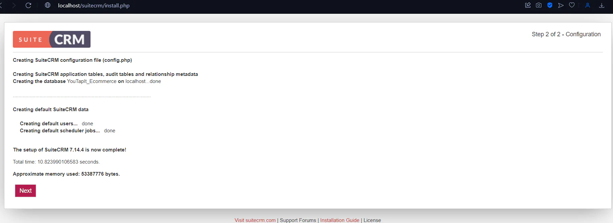
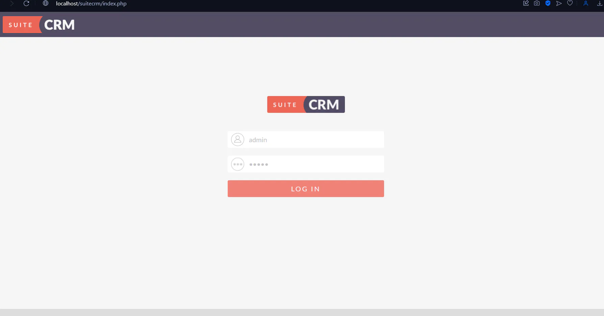
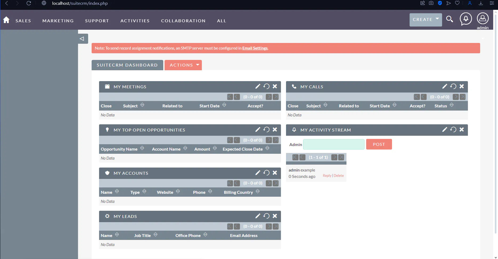

## SuiteCRM

SuiteCRM es una aplicación para servidores de código libre y está orientado a la Administración de la Relación de Cliente (Customer Relationship Management), está escrito en PHP y usa MySQL o MariaDB para la gestión de bases de datos relacionales.

Antes de comenzar la instalación hay que destacar el uso de XAMPP, al ser una distribución de Apache que contiene MariaDB y PHP será el indicado para esta labor.

### Las versiones a usar para esta distribución son

- XAMPP Control Panel 3.2.4
- Apache 2.4.58
- MariaDB 10.4.32
- MySQL 8.3.0
- Php 8.2.12
- PhpMyAdmin 5.2.1

Una vez instalado nuestro XAMPP podemos comenzar con nuestra instalación de SuiteCRM.

## Instalación

Tendremos que entrar al siguiente enlace para poder descargar el sistema SuiteCRM: <https://suitecrm.com/download/>.

Con nuestro archivo descargado, lo tendremos que copiar hacia nuestro servidor de XAMPP, ahí comenzaremos con la instalación, eso se hará en la ruta *C:\xampp\htdocs* por lo que podemos ahora extraer los archivos aquí. Una vez tengamos descomprimidos los archivos, podremos iniciar en la web con nuestro navegador, con nuestros servicios levantados, podemos cambiar el nombre de la carpeta para hacerlo mas directo al buscarlo.

Entramos a nuestro localhost para comenzar la instalación y para ello tendremos que acceder de esta forma: *<http://localhost/suitecrm>* en la cual, "suitecrm" es el nombre de la carpeta anteriormente mencionada, por lo que se puede buscar como la tengamos guardada en nuestra carpeta de manera local.

Se nos mostrará una vista de pre requisitos que tenemos que tener, revisamos que cumplamos con ellos y continuamos.

## Configuración

La información que se nos solicita es tanto para la base de datos en la cual le diremos la que necesitamos, como el usuario de la misma, en este caso el usuario de MySQL es root, por ser el administrador predeterminado, además de no tener la contraseña, luego ingresamos la información del usuario administrador de la aplicación de SuiteCRM, una vez hecho esto continuamos.

Se nos creará la base de datos con nuestros datos y se nos notificará de ello, continuamos.

Podemos ingresar ahora con nuestro usuario creado anteriormente.

Finalmente podemos acceder a nuestro SuiteCRM, en el cual podremos iniciar nuestras actividades.

